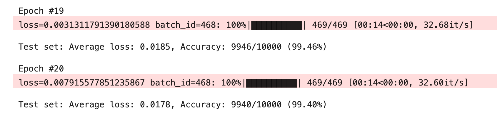

# Session 6 - Backpropagation and Advanced Architectures 🚀
## Part 1: Backpropagation Analysis with Varying Learning Rates

This repository contains detailed analysis of backpropagation in neural networks with a focus on the impact of different learning rates on the loss function as discussed in out `Sesstion 6`. The analysis is documented through a comprehensive Excel sheet and a series of visual charts, each corresponding to a specific learning rate.

### Excel Data

[`BackPropagation.xlsx`](BackPropagation.xlsx) contains detailed calculations and data points used to analyze the loss function across different learning rates.

### Loss Function Visualizations

The charts below showcase the loss function's behavior with varying learning rates during the training process of a neural network and we can see that loss function reduces as we increase the learning rate, whhich shows its learning and converging fast.

#### Learning Rate: 0.1

#### Learning Rate: 0.2

#### Learning Rate: 0.5

#### Learning Rate: 0.8

#### Learning Rate: 1.0

#### Learning Rate: 2.0

To view the analysis:
1. Download [`BackPropagation.xlsx`](BackPropagation.xlsx)  to see the raw data and calculations.
2. View the loss function charts above to understand how different learning rates affect the training process.

## Part 2 
Welcome to our exploration into the optimization of Convolutional Neural Network (CNN) architectures! This journey isn't about wielding the mightiest hammer but about the art of precision in tackling a classic digit classification challenge with the MNIST dataset.

🔍 **Understanding the Essence:**

Imagine being a teacher with a finite capacity for attention. The multitude of students before you represents the parameters your model must learn. Just as a classroom can't thrive with an overwhelming student-to-teacher ratio without compromising the quality of education (and inflating costs due to more hired help), our model too suffers under the weight of excessive parameters. Our mission? Achieve optimal performance without breaking the bank of computational resources.

🎯 **The Ultimate Goal:**

It's not just about hitting a high accuracy; it's about hitting *at least 99.40% accuracy*. Why? Because a homemade cake from Rohan is on the line! This exercise is a balancing act between achieving this accuracy and keeping our computational costs low, all within the tight timeframe of 20 epochs.

🧠 **Learning and Optimizing:**

Our initial challenge presents us with a model laden with 20 million parameters, a number we're tasked to drastically reduce to under 20K. Considering the simplicity of our subjects—digits, which can be deconstructed into circles and lines—we realize the potential for efficiency. By focusing on learning these basic features and cleverly combining them, we embark on a journey of significant simplification.

💡 **Strategic Reduction:**

Leveraging our insight into the nature of digits, we start our model with a mere 8 features, gradually building complexity through combination and strategic reduction. Techniques like MaxPooling help us 'zoom out' to see the bigger picture, enabling a systematic approach to feature learning and combination across our model's three key blocks:

1. **Learning Edges:** The foundational block for recognizing simple shapes.
2. **Learning Patterns:** A deeper dive into combining shapes into recognizable patterns.
3. **Learning the Object:** The culmination of our learning, recognizing digits as whole entities.

Transitions between these blocks are smoothed by 1x1 operations, acting as a filtration system to carry forward only the most significant features.

🔄 **Avoiding Information Overload:**

As we navigate through learning, we employ BatchNormalization to manage information saturation and Dropout to ensure our model doesn't become a mere memorization machine but learns to generalize from partially obscured data.

🏁 **Result:**

With a careful balance of feature learning, strategic reduction, and learning management, we achieve a triumphant **99.40% accuracy with about 8K parameters**, a testament to the efficiency and effectiveness of our approach.

📊 **Visual Insights:**
- Number of `parameters` 

- Model `accuracy` within 20 epochs 

# Code 

**Dive into our notebook** for a detailed journey through the architecture, strategy, and code that made this achievement possible. Join us in exploring the nuanced art of CNN optimization, where less truly can be more.

📓 Session 6 - Backpropagation and Advanced Architectures](S6.ipynb)